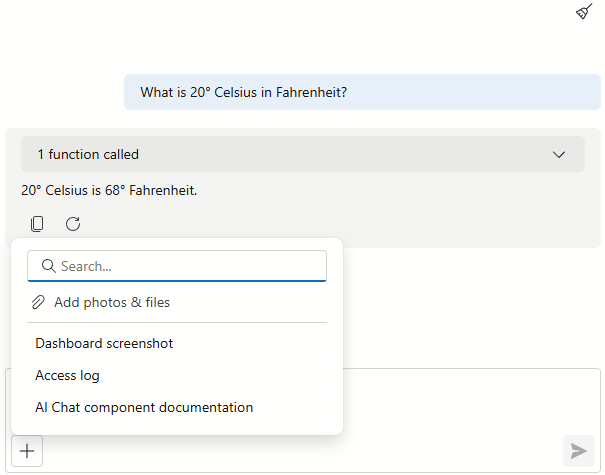

<!-- default badges list -->

[](https://supportcenter.devexpress.com/ticket/details/T1307851)
[](https://docs.devexpress.com/GeneralInformation/403183)
[](#does-this-example-address-your-development-requirementsobjectives)
<!-- default badges end -->
# DevExpress Blazor AI Chat - Integration with Model Context Protocol

In this example, the [DevExpress Blazor AI Chat](https://docs.devexpress.com/Blazor/DevExpress.AIIntegration.Blazor.Chat.DxAIChat) component leverages [Model Context Protocol (MCP)](https://modelcontextprotocol.io/docs/getting-started/intro) to extend AI model context with external data. MCP offers a standardized way for our Chat component to securely retrieve data from local files, databases, and third-party services, leading to greater precision and reduced hallucinations. For example, the model can:

- Connect to enterprise databases and other in-house data sources.
- Grant the AI model restricted access to a local directory or codebase.
- Allow your AI assistant to access technical manuals, API references, or internal wiki.
- Integrate AI Chat with productivity tools like Slack, GitHub, or Jira.
- Retrieve real-time data from the web using Puppeteer or search APIs.
- Connect AI chat to internal CRMs, ERPs, or other business applications.

You can quickly add new capabilities via the MCP server without a need to modify client code.



## Solution Structure

The solution consists of two projects:

- [AIChatMcpServer](CS/AIChatMcpServer): An MCP server that supplies tools, resources, and prompts to the client Blazor application.
- [AIChatMcpClient](CS/AIChatMcpClient): A Blazor Server application that hosts the DevExpress AI Chat component integrated with MCP server capabilities.

## Setup and Configuration

To run this example, configure project dependencies and set up secure authentication for the desired AI service.

### Prerequisites: AI Packages

We use the following versions of Microsoft AI packages in this project:

| NuGet Package                                                                                    | Version                 |
| ------------------------------------------------------------------------------------------------ | ----------------------- |
| [Microsoft.Extensions.AI](https://www.nuget.org/packages/Microsoft.Extensions.AI)                | 9.7.1                   |
| [Microsoft.Extensions.AI.OpenAI](https://www.nuget.org/packages/Microsoft.Extensions.AI.OpenAI/) | 9.7.1-preview.1.25365.4 |
| [Azure.AI.OpenAI](https://www.nuget.org/packages/Azure.AI.OpenAI)                                | 2.2.0-beta.5            |

We cannot guarantee compatibility or correct execution with newer versions. Refer to the following announcement for additional information: [DevExpress.AIIntegration moves to a stable version](https://supportcenter.devexpress.com/ticket/details/t1292705/devexpress-aiintegration-references-stable-versions-of-microsoft-ai-packages).

### Register an AI Service

> [!NOTE]
> DevExpress AI-powered extensions follow the "bring your own key" principle. DevExpress does not offer a REST API and does not ship any built-in LLMs/SLMs. You need an active Azure/Open AI subscription to obtain the REST API endpoint, key, and model deployment name. These variables must be specified at application startup to register AI clients and enable DevExpress AI-powered Extensions in your application.

This example uses the [Azure OpenAI](https://azure.microsoft.com/en-us/products/ai-foundry/models/openai/) service. For security, secrets are stored in the [appsettings.json](CS/AIChatMcpClient/appsettings.json) file inside the **AIChatMcpClient** project. Update the `AzureOpenAI` section with your Azure OpenAI credentials:

- `Endpoint`: Your Azure OpenAI endpoint
- `ApiKey`: Your Azure OpenAI key
- `DeploymentName`: Azure OpenAI [model ID](https://learn.microsoft.com/en-us/azure/ai-services/openai/concepts/models)

### Run the Solution

The solution implements a client-server pattern:

- The MCP Server runs as a background service at http://localhost:5002/mcp.
- The client opens a web UI with DevExpress AI Chat at http://localhost:5001.

The **AIChatMcpServer** project must be operational for the **AIChatMcpClient** to function. If you start the solution from Visual Studio, select **AI Chat with MCP** from the **Startup Item** dropdown. If you run a solution from a command line, ensure the **AIChatMcpServer** project is running before starting the **AIChatMcpClient** project.

## Implementation Details

### MCP Server

The MCP server acts as a bridge between AI Chat and your data/services. It exposes tools/resources/prompts and allows the client application to interact with data and services via a standardized interface.

This example features a custom MCP server to demonstrate core integration patterns. Because the implementation follows Model Context Protocol [standards](https://modelcontextprotocol.io/docs/learn/architecture), you can reuse the same code to connect the AI Chat to any MCP-compliant service.

#### Tools

The server exposes three [tools](CS/AIChatMcpServer/Entities/Tools.cs) that AI Chat can invoke:

- `get_time_with_zone`: Returns current time with timezone.
- `celsius_to_fahrenheit`: Temperature conversion utility (from Celsius to Fahrenheit).
- `text_exception`: Simulates a server-side exception for debug and error handling verification.

#### Resources

Through the server, the chat can read the following [static files](CS/AIChatMcpServer/Entities/Resources.cs):

- [Access log](CS/AIChatMcpServer/Data/access.txt): Nginx-style HTTP server log with errors and requests.
- [AI Chat API Reference](CS/AIChatMcpServer/Data/dxaichat.md): DevExpress Blazor AI Chat component documentation.
- [Screenshot](CS/AIChatMcpServer/Data/dashboard.jpg): A binary image for use with multimodal LLMs.

#### Prompts

The MCP server exposes reusable [prompt templates](CS/AIChatMcpServer/Entities/Prompts.cs) that accept dynamic arguments. These templates provide instant access to common tasks, allowing users to execute complex workflows without manual prompt engineering.

### Chat Client

The [DevExpress Blazor AI Chat](https://docs.devexpress.com/Blazor/DevExpress.AIIntegration.Blazor.Chat.DxAIChat) connects to Azure OpenAI and [loads](https://docs.devexpress.com/Blazor/DevExpress.AIIntegration.Blazor.Chat.DxAIChat.Resources) available tools, resources, and prompts from the MCP server at http://localhost:5002/mcp.

```Razor
<div class="main-container">
    <DxAIChat Resources="Resources">
        <PromptSuggestions>
            @foreach (var suggestion in PromptSuggestions){
                <DxAIChatPromptSuggestion PromptMessage="@suggestion.PromptMessage"
                                          Title="@suggestion.Title"
                                          Text="@suggestion.PromptMessage"/>
            }
        </PromptSuggestions>
    </DxAIChat>
</div>

@code{
    IEnumerable<AIChatResource> Resources { get; set; } = [];
    IEnumerable<PromptSuggestion> PromptSuggestions { get; set; } = [];

    protected override async Task OnInitializedAsync() {
        Resources = McpRepository.Resources.Select(x => new AIChatResource(x.Uri, x.Name,
        	              LoadResourceData, x.MimeType, x.Description));
        PromptSuggestions = McpRepository.PromptSuggestions;
        await base.OnInitializedAsync();
    }

    async Task<IList<AIContent>> LoadResourceData(AIChatResource resource, CancellationToken ct) {
        var readResource = await McpRepository.Client.ReadResourceAsync(resource.Uri, cancellationToken: ct);
        return readResource.Contents.ToAIContents();
    }
}
```

When you interact with the chat:

- Messages are sent to Azure OpenAI.
- The model automatically identifies and invokes relevant MCP tools.
- AI Chat displays the result.

A connection between the MCP client and an MCP server endpoint is managed in [McpRepository.cs](CS/AIChatMcpClient/Services/McpRepository.cs). The application initializes an `McpClient` instance on startup to load available tools, resources, and prompts from the MCP server. The class implements `IHostedService` to manage lifecycle and `IAsyncDisposable` for proper cleanup of the connection.

## Files to Review

- [Prompts.cs](CS/AIChatMcpServer/Entities/Prompts.cs)
- [Resources.cs](CS/AIChatMcpServer/Entities/Resources.cs)
- [Tools.cs](CS/AIChatMcpServer/Entities/Tools.cs)
- [AIChatMcpServer/Program.cs](CS/AIChatMcpServer/Program.cs)
- [Index.razor](CS/AIChatMcpClient/Components/Pages/Index.razor)
- [McpRepository.cs](CS/AIChatMcpClient/Services/McpRepository.cs)
- [AIChatMcpClient/Program.cs](CS/AIChatMcpClient/Program.cs)
- [appsettings.json](CS/AIChatMcpClient/appsettings.json)

## Documentation

- [DxAIChat](https://docs.devexpress.com/Blazor/DevExpress.AIIntegration.Blazor.Chat.DxAIChat)
- [Resources](https://docs.devexpress.com/Blazor/DevExpress.AIIntegration.Blazor.Chat.DxAIChat.Resources)
- [AIChatResource](https://docs.devexpress.com/Blazor/DevExpress.AIIntegration.Blazor.Chat.AIChatResource)

<!-- feedback -->
## Does This Example Address Your Development Requirements/Objectives?

[](https://www.devexpress.com/support/examples/survey.xml?utm_source=github&utm_campaign=blazor-ai-chat-mcp-resources&~~~was_helpful=yes) [](https://www.devexpress.com/support/examples/survey.xml?utm_source=github&utm_campaign=blazor-ai-chat-mcp-resources&~~~was_helpful=no)

(you will be redirected to DevExpress.com to submit your response)
<!-- feedback end -->
